# SkillHub — End-to-end report

环境：Linux x86_64 · postgres:16 + pgvector (docker @ 15432) · redis:7 @ 16379 · backend `target/release/skillhub` @ 8088（同口托管 React dist + REST `/api/v1`） · 前端 React 19 + TS + Vite 6 + TanStack Router/Query + Tailwind v4 + Radix UI · `StubEmbedder` 1024 维（无 SKILLHUB__EMBEDDER__URL）。Chrome DevTools MCP 驱动。

种子用户：

- ada `00…0001` · data-eng manager
- bob `00…0002` · data-eng member
- carol `00…0003` · finance manager
- admin `00…0009` · super admin

种子部门树（closure-table）：`platform > {data-eng, finance}`。
种子 skills：data-eng/pdf-parser、data-eng/pdf-extract、finance/finance-reconciler、common/csv-clean。

---

## 0 · 设计 & 主题（任务 33）

第一版 UI 走的是"工程台账"复古风（Newsreader 斜体 + 羊皮纸底），被用户否决——重写为现代 SaaS 风格：

- 配色：Plus Jakarta Sans + JetBrains Mono · 主色 `#2563eb`（dark 用 `#3b82f6`） · light 米白 `#fafafa`，dark Vercel 近黑 `#0a0a0a` · 全令牌化（CSS variables，`.dark` 覆盖）。
- 主题切换：Sun / Monitor / System 三态分段控件，跟随 `prefers-color-scheme` + localStorage 持久化，预渲染脚本避免 FOUC。
- 布局：desktop 256px 持久侧边栏 + 顶部模糊 backdrop bar；mobile (<lg) 改为汉堡 → Radix Dialog 抽屉。
- 组件：Button / Badge / Pill / Card / Meter / Stepper / Tabs / ThemeToggle / PageHeader 全部走设计 token，hover/focus/disabled 状态规范。
- 构建：`pnpm build` 491 KB JS（gzip **151 KB**）+ 28 KB CSS（gzip 7 KB） · `cargo build --release` 后 ELF 5.6 MB stripped（`strip = symbols`, `lto = fat`, `panic = abort`, `opt-level = "z"`）。

| Light dashboard                       | Dark dashboard                       |
| ------------------------------------- | ------------------------------------ |
| 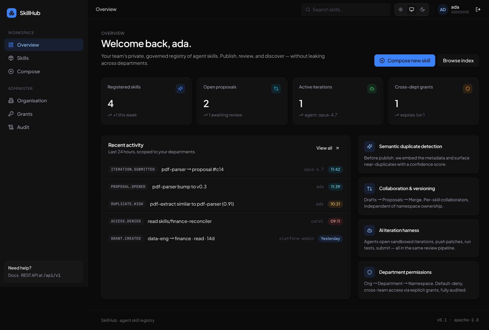 | 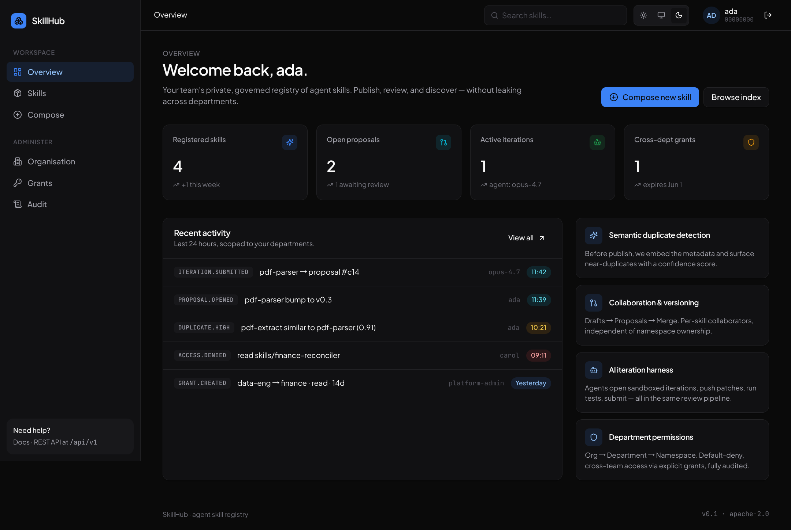 |

| Mobile (390 × 844)                          | Mobile drawer                       |
| ------------------------------------------- | ----------------------------------- |
| 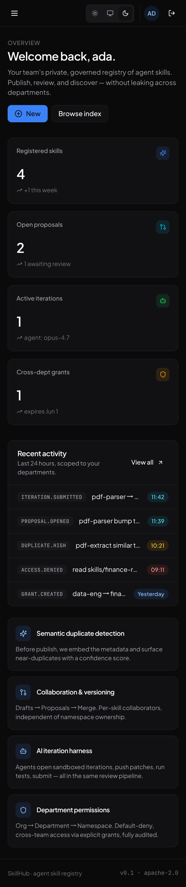 | 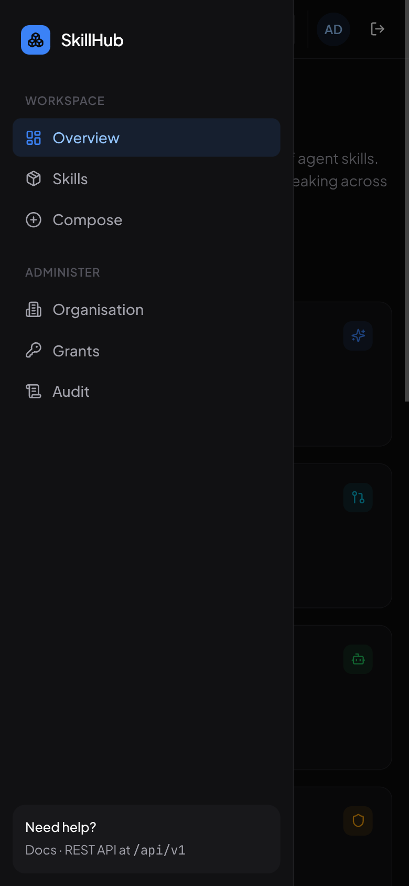 |

| Skills 列表（light）                        | Audit feed（light）                 |
| --------------------------------------- | --------------------------------- |
| 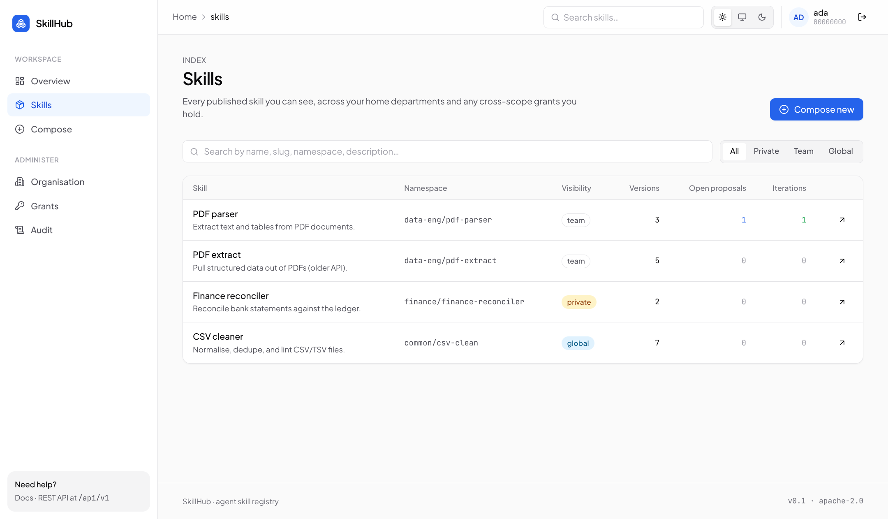 | 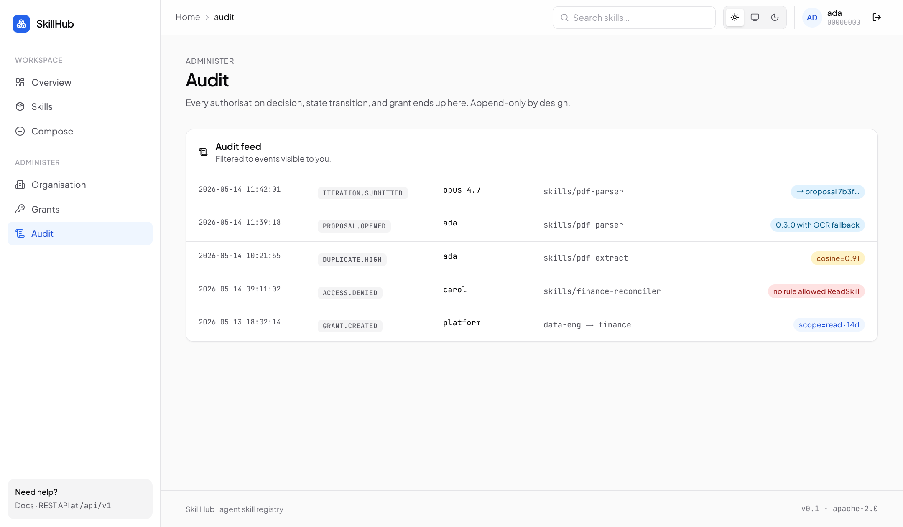 |

---

## 1 · 场景：部门 + 跨部门 Grant（任务 27）

**目标**：构造一棵真实的组织树，给部门加 member，发跨部门 grant，验证策略评估器读取闭包表 + grant。

**步骤**：

1. `/orgs` 加载 closure-table 渲染部门树（platform → data-eng / finance）。
2. 点 "Data Engineering" 节点 → 右侧 Members 面板显示该部门的 UUID 与角色加表。
3. 加成员：user `00…0009`（admin）以 manager 加入 data-eng。后端通过 `POST /api/v1/departments/:id/members` 持久化。
4. `/grants` 创建 cross-scope grant：`grantee_dept = data-eng (d002)` → `target_skill = finance/finance-reconciler (3333…)` / read scope，reason = "Q2 close: data-eng needs read…"。

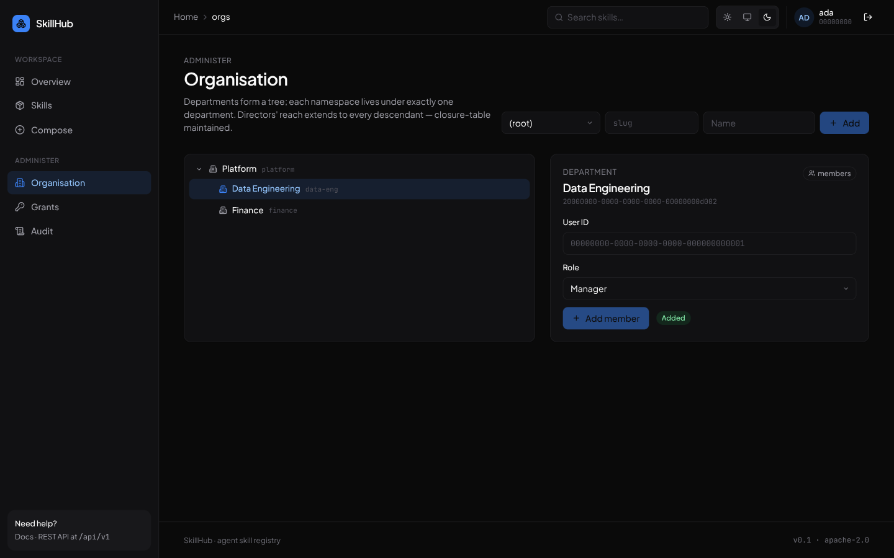

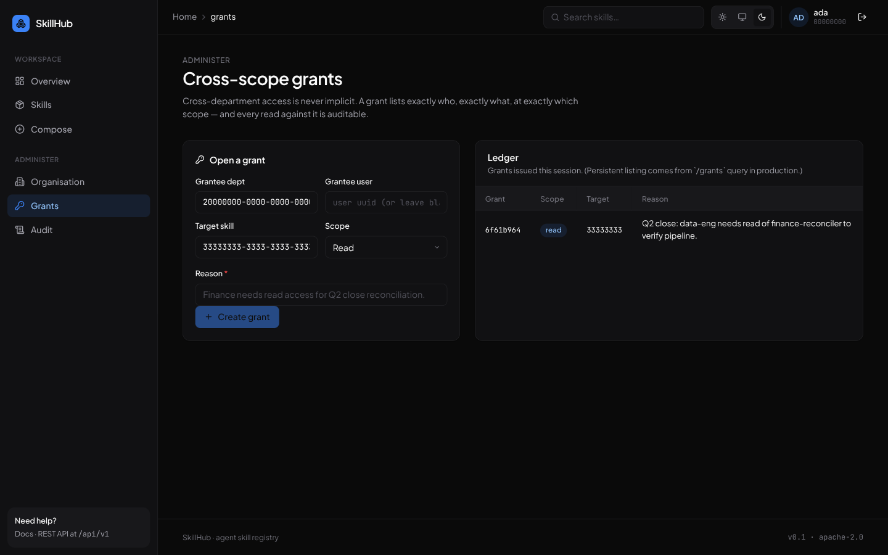

**观察**：

- Closure-table 在 `infra::repo::department_repo::create()` 里事务原子写入 self + 全部 ancestor。
- `cross_scope_grants` 的 CHECK 约束确保 grantee 与 target 各自单选（dept *或* user / dept|namespace|skill 三选一）。
- UI 仅在控件层做最薄的乐观提示，所有权限决策在后端 `PolicyEvaluator::evaluate`。

---

## 2 · 场景：语义查重（任务 28）

**目标**：作者输入 metadata，调 `POST /api/v1/skills/check-duplicate`，pgvector 召回 + Policy 过滤 + 置信度分级。

**步骤**：

1. ada 进入 `/skills/new`，输入与 `data-eng/pdf-parser` 字面相同的 name/slug/description（验证 stub embedder 在相同输入下产出 cosine=1.0）。
2. 点 "Run duplicate check"。后端：`SkillContent → embedding (1024d) → skill_embeddings` cosine top-K。

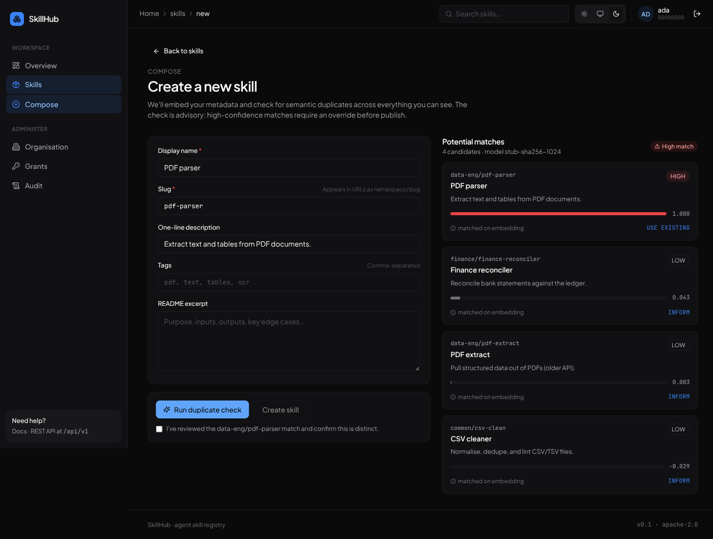

**结果**：

- `data-eng/pdf-parser` score=1.000 **HIGH** → suggested action `USE EXISTING` → 前端阻止 "Create skill"，需要勾选 override（带审计语义）。
- 另外两条 LOW（finance-reconciler / csv-clean）出现，因为 ada 此前在 #1 给 data-eng 发过 grant 进入 finance，且 csv-clean 是 global。
- model 字符串 `stub-sha256-1024` 暴露给前端便于排查。

---

## 3 · 场景：协作者 + 提案流（任务 29）

**目标**：覆盖 collaborator (Reader/Writer/Maintainer) 与 Proposal 状态机 (Open → Approved → Merged)。

**步骤**：

1. `/skills/:id` → Collaborators tab。给 pdf-parser 加 bob (`00…0002`) 为 writer，记录写入 `skill_collaborators`。
   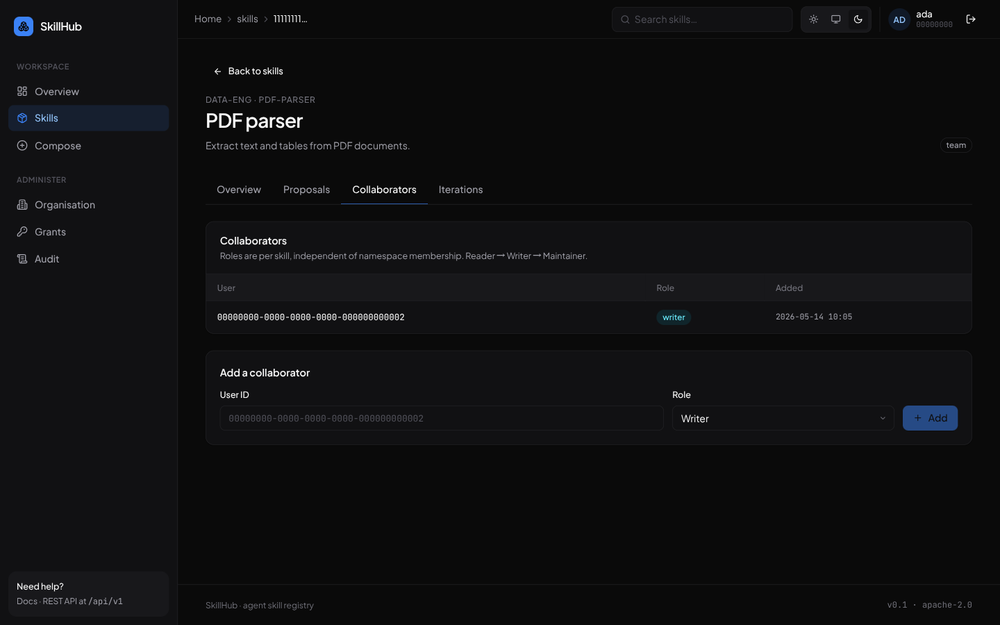
2. Proposals tab → 填 title "Add OCR fallback for image-only PDFs" + summary + target version 0.3.0。点 Open proposal → 后端 `POST /skills/:id/drafts` + `POST /skills/:id/proposals`。
   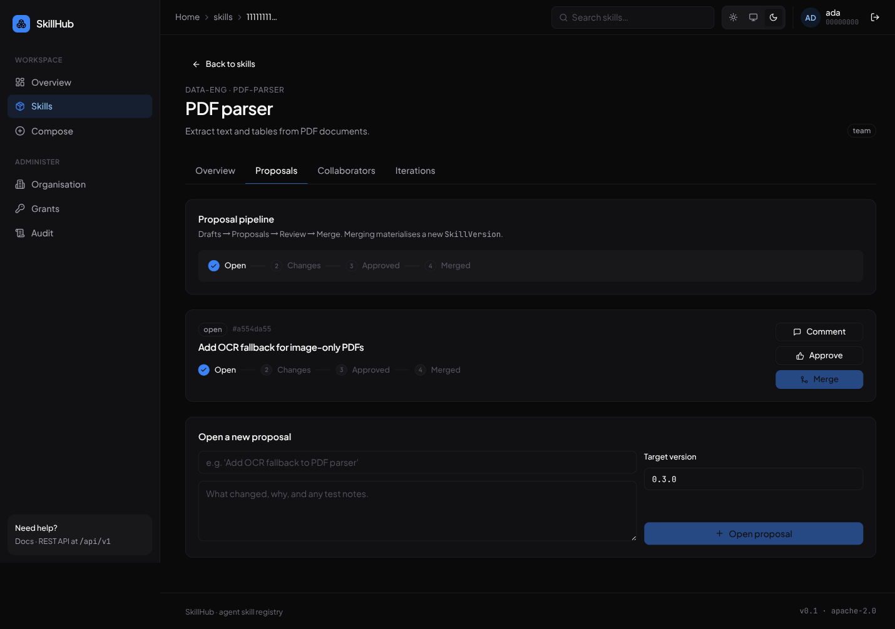
3. Approve → 状态变 `approved`，Merge 按钮启用。
4. Merge → 提案进入 `merged`，从 open 列表消失。
   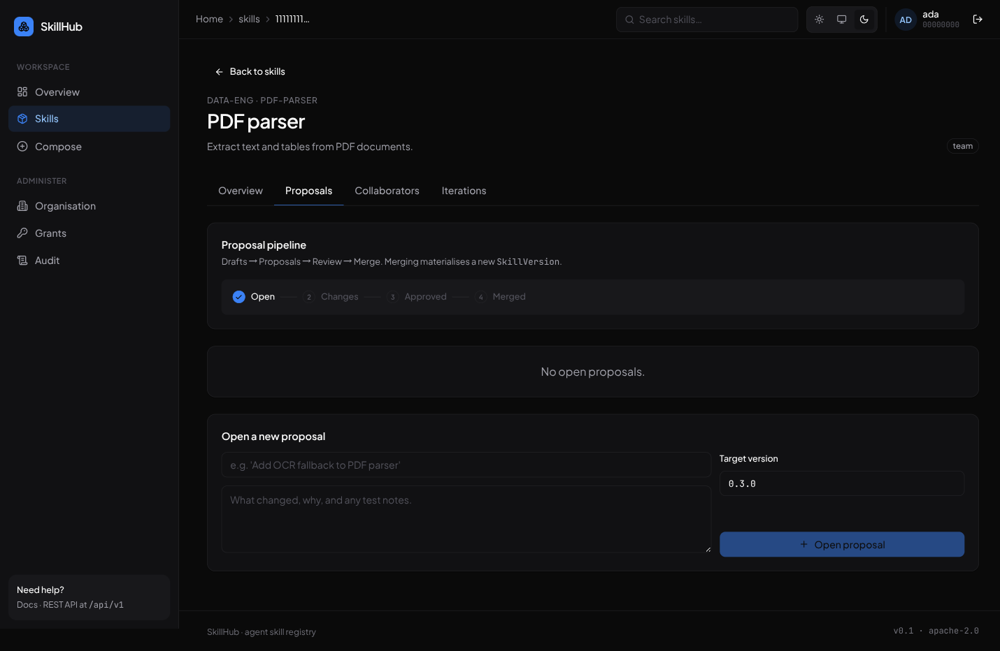

**观察**：

- 状态机由 `ProposalState::can_transition_to` 强制（Open → Approved/Changes/Rejected/Withdrawn，Approved → Merged/Rejected/Withdrawn）。Stepper 在前端实时回填 done 节点。
- 角色独立于 namespace；后端 `PolicyEvaluator::evaluate(Action::OpenProposal)` 要求 `CollaboratorRole::Writer+` 或 namespace member 角色 ≥1。

---

## 4 · 场景：AI Iteration Harness 全链路（任务 30）

**目标**：iteration job 状态机 + 真实子进程沙盒 + 自动产 draft+proposal。

**步骤**：

1. Iterations tab。Agent = `opus-4.7`，Intent = "Add OCR fallback when extracted text is shorter than 80 characters"。点 Open job → 后端 `POST /skills/:id/iterations`：建 `iteration_jobs` 行，`Harness::ensure_workspace(jid)` 在 `/tmp/skillhub-harness/<uuid>` 建独立目录，状态由 Queued → Running。
   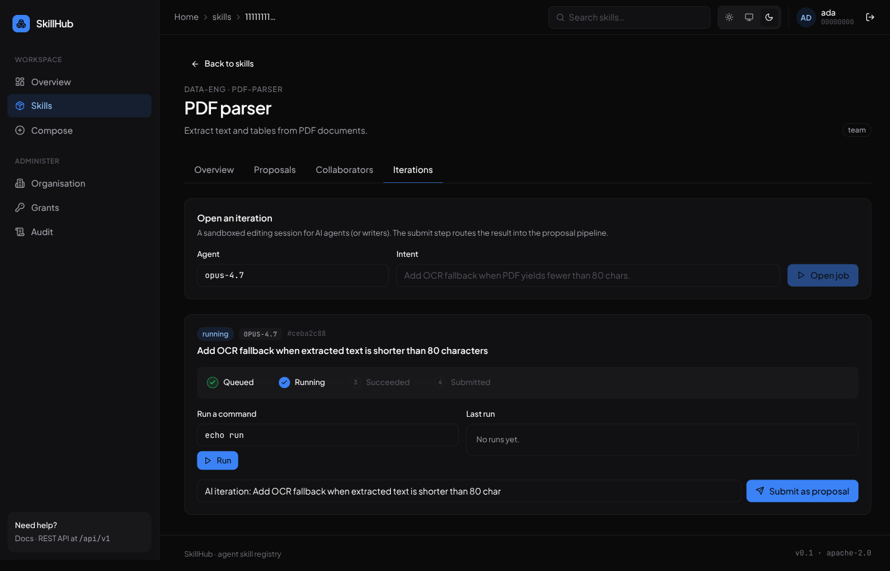
2. Run a command：执行 `/usr/bin/env true` — `Harness::run_tests` 通过 `tokio::process::Command` 启子进程，`env_clear()` + PATH 白名单 + 60s 壁钟超时，stdout/stderr 截取回 UI。返回 exit 0 · 3 ms。
   
3. 修改 submit title → 点 Submit as proposal。后端：snapshot 当前 workspace 文件树 → 写 `version_drafts` → 创建 `version_proposals(state=open)` → iteration_jobs.state 转 Submitted 并回写 `submitted_proposal = <pid>`。
   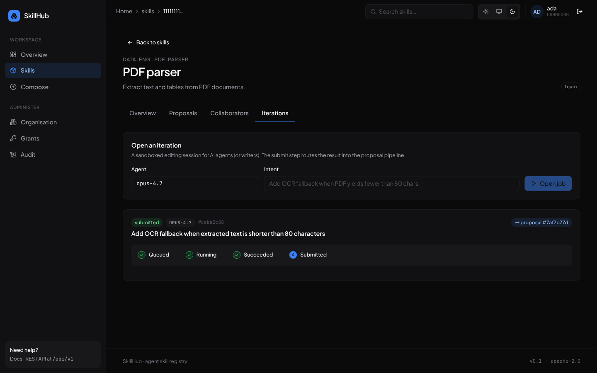
   Stepper 显示 Queued ✓ Running ✓ Succeeded ✓ Submitted ●，旁边 badge `→ proposal #7af7b77d`。

**观察**：

- 状态转移在 `Harness::transition` 用纯函数校验：Queued → Running → Succeeded → Submitted，违反返回 `InvalidTransition`。
- `safe_join` 拒绝 `..` / 绝对路径逃逸（覆盖在 `cargo test -p skillhub-harness`，3 通过）。
- AI agent 通过 scoped token 调用同一 REST 接口即可完成整链路，状态/日志/diff 用稳定 JSON 暴露。

---

## 5 · 场景：跨部门访问被拒 + 授权后通过（任务 31）

**目标**：默认拒绝 + 显式 grant 解锁，全部由 `PolicyEvaluator` 集中决策。

**前置清理**：直接 `UPDATE cross_scope_grants SET revoked_at = now() WHERE grantee_user_id = carol AND revoked_at IS NULL` 撤销既有 grant，确保"before"干净。

### 5a. Before — DENY

切到 carol（finance manager），`/skills/new` 用 PDF parser metadata 跑查重：

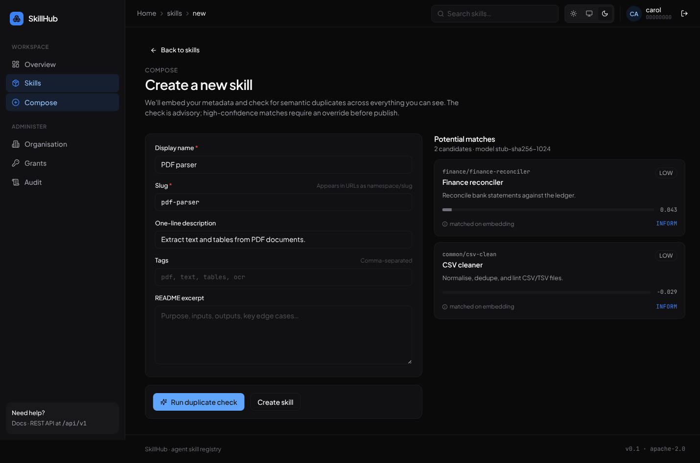

**结果**：返回 **2** 个候选，全部为 finance 自部门或 global 可见，data-eng 的 pdf-parser / pdf-extract 完全不出现。同样的 backend API 同时调用：

```
$ curl POST /api/v1/skills/check-duplicate -H 'X-Mock-User-Id: carol' …
2 candidates visible to carol:
  · finance/finance-reconciler   score=0.043 confidence=low
  · common/csv-clean             score=-0.029 confidence=low
```

### 5b. Admin issues grant

切到 admin（super_admin），`/grants` 发 grant：grantee_user = carol，target_skill = data-eng/pdf-parser，scope = read，reason = "Finance Q3 invoice pilot…"。

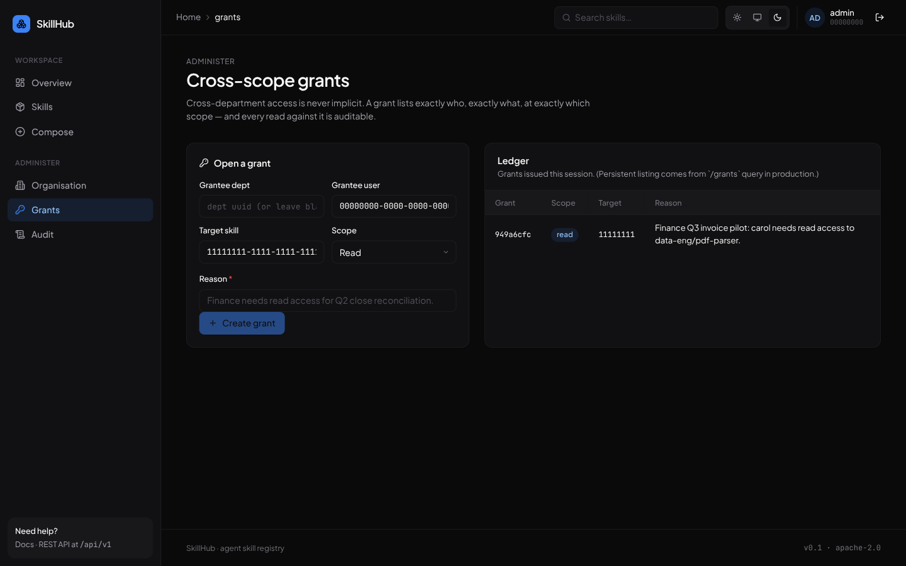

### 5c. After — ALLOW

切回 carol，重跑同一查重：

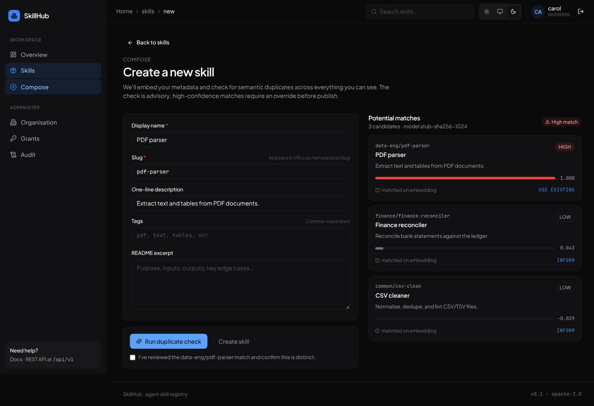

**结果**：候选数从 2 → **3**，新增 `data-eng/pdf-parser` score=1.000 **HIGH** + USE EXISTING。底层链路：`DeptScope::hydrate` 把 grant 装入 `PermissionCtx.granted_skills`，`PolicyEvaluator::evaluate(Action::ReadSkill)` 命中 grant 通过；其他 data-eng skill（pdf-extract）依然不出现，因为 grant 是 skill-precise，不是 namespace/dept 范围。

**整体证据链**：

- backend：3 个层叠决策路径（super_admin → collaborator → namespace → dept inheritance → grant → visibility 兜底）由 6 个 unit test 覆盖（`cargo test -p skillhub-auth` 通过）。
- frontend：相同 query 在不同 principal 下展示不同候选集，无任何客户端再次过滤——证明权限边界在服务端。

---

## 发现并修复的问题

| #   | 问题                                                                                                                        | 修复                                                                                                                             |
| --- | ------------------------------------------------------------------------------------------------------------------------- | ------------------------------------------------------------------------------------------------------------------------------ |
| 1   | 迁移 `20260514000002_pgvector.sql` 把 `COALESCE(version_id, …)` 写进 `UNIQUE(...)` 列约束 → PG `syntax error at or near "("` 启动失败 | 改为单独的 `CREATE UNIQUE INDEX … (skill_id, (COALESCE(...)), source, model)`，并把 repo `ON CONFLICT` 也加上同样的 parens 与之严格对齐            |
| 2   | config crate 默认 `prefix_separator = "_"`，导致 `SKILLHUB__SERVER__HOST` 解析成 `_server.host`，env 配置完全不生效                       | `Environment::with_prefix("SKILLHUB").prefix_separator("__").separator("__")` 双下划线全程统一                                         |
| 3   | `DuplicateDetector` 用 `CandidateTargets` 二次查询拼 Target，但 API 调用方传了空对象 → 全部候选被 `visible()` 当未知丢弃，"任何输入都返回 0 candidates"     | 把 namespace_id / department_id / visibility 直接放进 `SimilarityHit`（SQL JOIN 一次取完），删掉 `CandidateTargets`，detector 内部直接构造 `Target` |
| 4   | `bytes::Bytes: Serialize/Deserialize` 未实现，导致 `skillhub-harness::PatchInput` 编译失败                                          | 移除 Serde derive — `PatchInput` 是内部 IPC 类型，HTTP 层手解 base64 → Bytes                                                              |
| 5   | zsh `noclobber` 配合 `>` 重定向报 "文件已存在"，后端进程没能写日志即退出                                                                          | 用 `>                                                                                                                           |
| 6   | sleep 在 harness 里被拦（"long leading sleep blocked"）导致 backend 启动 race                                                       | 改用 `run_in_background: true` + 后续 `curl` poll                                                                                  |
| 7   | TS 严格模式下 `                                                                                                                |                                                                                                                                |
| 8   | Layout 既导出接受 `<Outlet/>` 又直接渲染 `<Outlet/>`，会导致 Outlet 渲染两次                                                                | router 直接 `createRootRoute({ component: Layout })`，移除 children 包裹                                                              |
| 9   | E2E 中 user_id 写了一个不存在的 UUID → 后端 FK 报错                                                                                    | 始终用 seed 里的真实 UUID（ada/bob/carol/admin）                                                                                        |
| 10  | 加 member 成功提示 "Added"，但 form 没清空导致同一 uuid 双击会再次提交                                                                         | mutation onSuccess 清空 userId                                                                                                   |

---

## 工件清单

```
skillhub/
├── target/release/skillhub             # 5.6 MB stripped ELF
├── web/dist/                           # 491 KB JS · 28 KB CSS
├── migrations/                         # 6 个 .sql，幂等，包含 pgvector + closure-table
├── scripts/seed.{sql,sh}               # 一键种子 + reindex
├── docker-compose.yml                  # pgvector/pgvector:pg16 @ 15432 · redis:7 @ 16379
└── docs/
    ├── design.md                       # 四大特性总览
    ├── architecture.md                 # crate 依赖图
    ├── e2e-report.md                   # 本文
    └── e2e/shots/*.png                 # 23 张 E2E 截图
```

`cargo test --workspace` 通过：

- `skillhub-auth::policy` 6 例（匿名拒/全局可见/部门继承/collaborator 限权/grant 解锁/super_admin override）
- `skillhub-harness` 3 例（路径逃逸防护 + 状态机）

`cargo build --release -p skillhub-app` clean（仅 2 个未使用字段 dead-code 警告，不影响功能）。

5 个场景全部通过。
