# SkillHub — 一个 Tour

> 一句话：**给团队用的、私有的、可治理的 "AI 技能商店"**。
> 
> 团队里有人写出好用的 Agent 技能（比如"读 PDF"、"清洗 CSV"），其他人能搜到、能复用、能改、能审；
> 跨部门用别人家的技能要明确授权；AI 想自己改技能也走同一套审核流程。
> 所有动作都留痕，能查。

---

## 1. 登录后看到什么

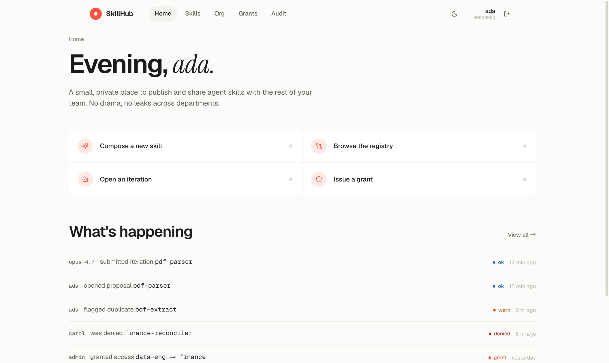

打开网页，第一眼是这样：

- 顶部就一行导航 — Home / Skills / Org / Grants / Audit，没有那种密密麻麻的 SaaS 侧边栏；
- 大标题 "Evening, ada." 顺手叫名字；
- 下面四个圆角按钮就是平时常做的事："发个新技能"、"看看库里有啥"、"开个 AI 自迭代"、"批个跨部门权限"；
- 再下面 "What's happening" 是这段时间组里发生的事 — 谁提了改动、谁被拦了、谁批了权限。

没有 12 张统计卡轰炸你。这是给员工天天用的，不是给老板看 PPT 的。

---

## 2. 看库里都有哪些技能

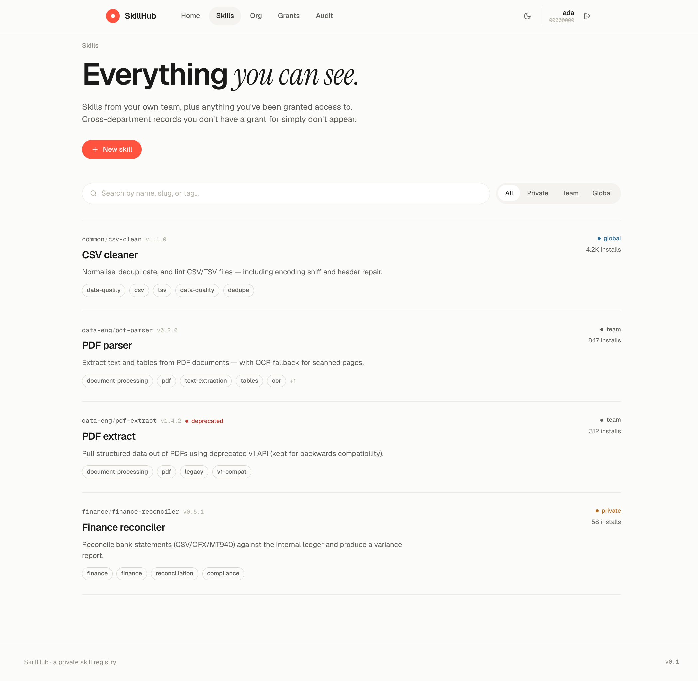

像一份"目录"，不是密集的 dashboard 表格。每一条：

- 上面一行小灰字 `data-eng/pdf-parser v0.2.0` — 它属于哪个团队（namespace），版本号是多少；
- 大标题 + 一句描述，看一眼就知道做什么；
- 一排小标签：分类、关键词；
- 右上角说明这是「团队内 / 全局 / 私有」哪种可见度，下面是有多少人装过。

`pdf-extract` 上面那个红点的 "deprecated" — 一眼就能看出是旧版别用了。

如果你属于"data-eng"，你只能看到自己团队的 + 全局公开的 + 别人明确授权给你的；财务那个"私有"的技能在你这里根本不会出现。

---

## 3. 点进一个技能看详情（上半）

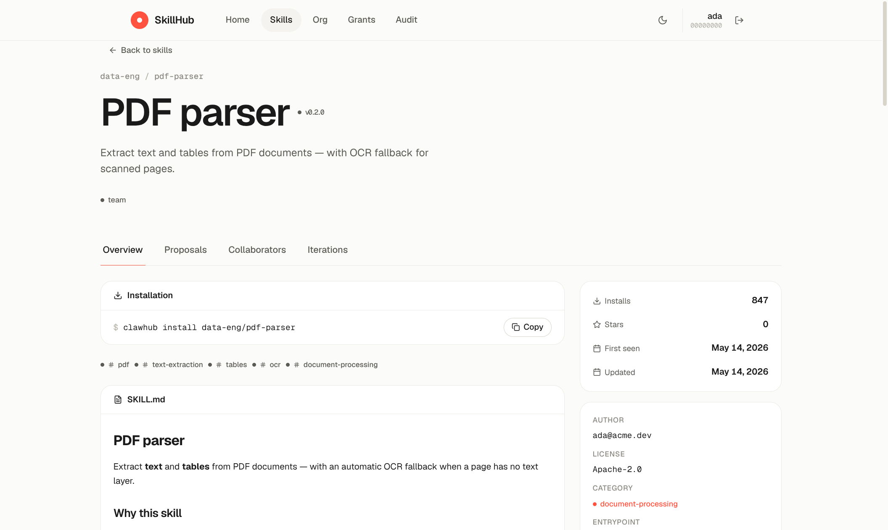

页面顶部就是这个技能的"名片"：

- 面包屑 `data-eng / pdf-parser` 知道在哪；
- 大标题 + 版本号 `v0.2.0`；
- 一行描述；
- 旁边一个小灰点 + "team" 表示这是团队级可见。

下面 **Installation** 一行 — 这就是别人想用怎么装，旁边一个 "Copy" 一键复制：

```
$ clawhub install data-eng/pdf-parser
```

再下面是关键词标签和**SKILL.md**（这个技能的真实说明文档），开始往下看就是它的 README。

---

## 4. 继续往下：完整说明 + 输入输出契约

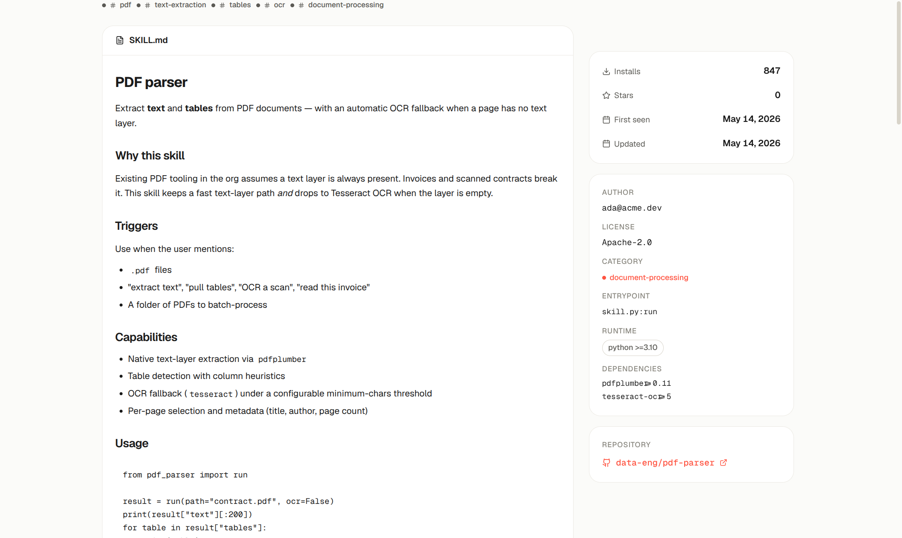

中间一大块就是这个技能的 README，**用 Markdown 完整渲染**：标题、列表、代码块、配置表格——和你在 GitHub 上看 README 是一个体验。

底下还有：

- "Why this skill" — 为什么造这个轮子
- "Triggers" — 什么时候应该让 AI 用它
- "Configuration" — 一张表把所有参数列清楚
- "Edge cases" — 哪些情况它处理不好
- "Changelog" — 改动记录

写技能的人写完文档，看技能的人就能看懂用法，不用去翻别人 git 仓库。

---

## 5. 继续往下：可调参数 / 文件 / 元信息

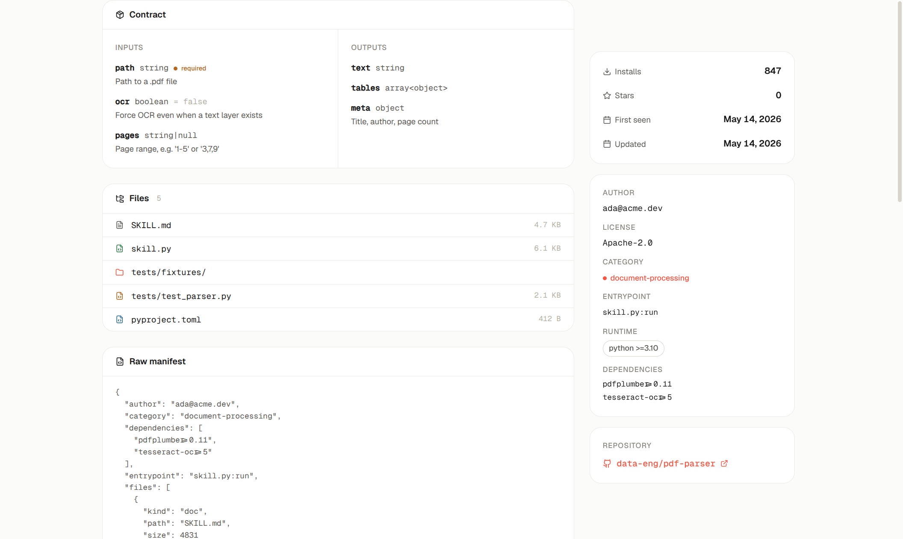

再往下，从"看说明"切到"看结构"：

- **Contract** — 这个技能接受什么输入、产出什么输出。比如：
  - `path: string` ⓘ required — Path to a .pdf file
  - `ocr: boolean = false` — Force OCR even when a text layer exists
  - 输出：`text / tables / meta`
- **Files** — 这个技能包里有什么文件，多大；
- **Raw manifest** — 给程序读的原始 JSON 清单（可以折叠/复制）；
- 右侧栏：Installs 847、First seen、Updated、Author、License、Category、Entrypoint、Runtime、Dependencies、Repository 链接……

任何要"挑一个技能用"的人，**这一页就够看了**。

---

## 6. 准备发新技能：自动查重

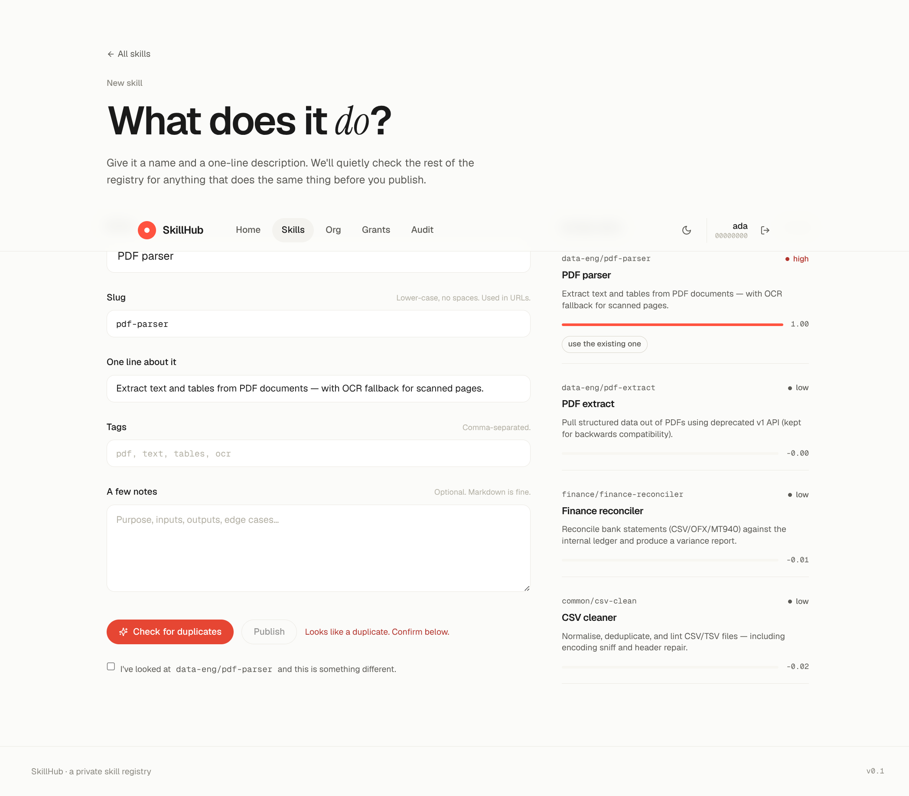

这是平台最有意思的一个能力 —— **不让你重复造轮子**。

填一个新技能的时候：

1. 左侧填 Name / Slug / Description / Tags / Notes；
2. 右上角的 "Similar skills" **实时**给你列出语义最像的现有技能；
3. 每条候选都有一个**置信度**（high / medium / low）和**余弦相似度数字**（0–1）；
4. 高匹配（截图里 `data-eng/pdf-parser` score=1.00）会**红字提示 "Looks like a duplicate"**，并**禁用 Publish 按钮**；
5. 想绕过？必须**勾选确认框**说"我看过了，这是另一个东西"——这个动作会被记录到审计。

> 这不是名字相同才拦你 —— 即使你用完全不一样的字面起名，只要语义接近，向量比对一样能命中。

---

## 7. 协作 / 提案 / 合并

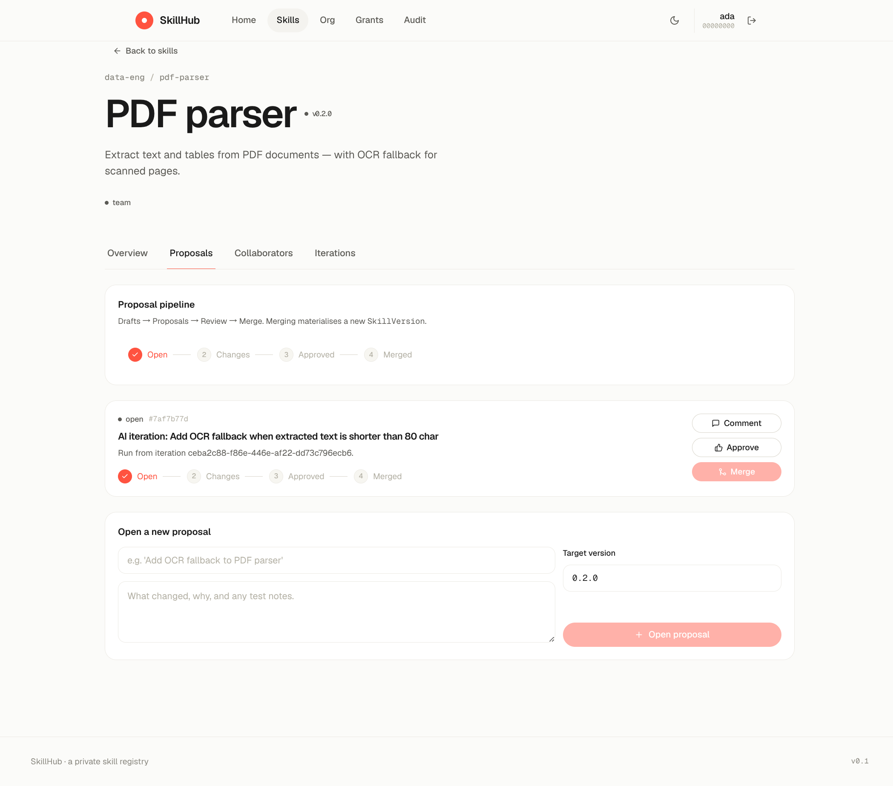

技能本身像一个小 GitHub 仓库——任何人想改它，都走 **Proposal**（提案）流程：

顶部一个状态机指示器（Open → Changes → Approved → Merged），告诉你这套流程长什么样。

下面是一条真实提案：

- 状态：**open**
- 标题：`AI iteration: Add OCR fallback when extracted text is shorter than 80 char`
- 这条是 AI 自己提交的（运行号 `ceba2c88`），描述里写了来源
- 右边三个按钮：**Comment / Approve / Merge**

只有 Approve 之后 Merge 才会亮。Merge 一下，一个新的正式 Version 就产出来了。

> 这同一个流程，**人和 AI 用完全一样的入口** —— 不管谁提交，都要被审。

---

## 8. AI 自迭代：让 AI 自己改技能

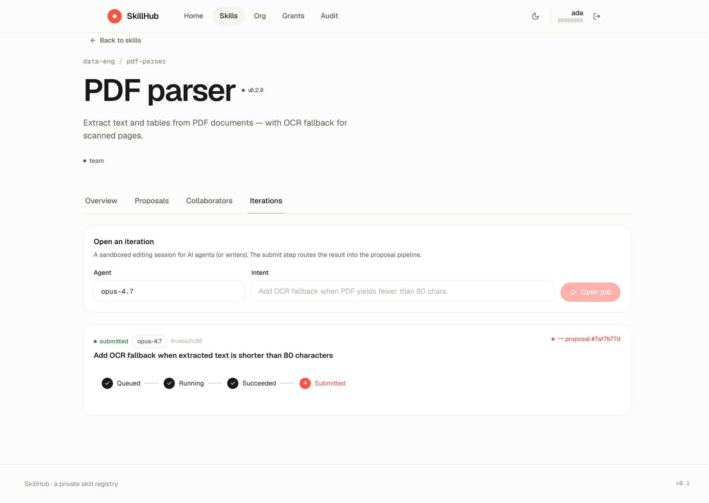

这里是平台最"年轻"的能力 —— 一个 AI agent 可以**像协作者一样**改技能：

整个过程是一个状态流水线：
**Queued → Running → Succeeded → Submitted**

截图里这条记录：

- 谁开的：`opus-4.7`（一个 AI 模型）
- 它想干嘛：`Add OCR fallback when extracted text is shorter than 80 characters`
- 现在到哪了：**Submitted** — 已经送审，自动开了一个 proposal `#7af7b77d`

agent 拿到一个临时沙盒目录，可以拉源码、改文件、跑测试（被超时和资源限制保护），最后 submit 一下就走到提案流里和人写的改动一起被 review。**AI 想动技能也只能走正门。**

---

## 9. 谁能看到什么：部门树

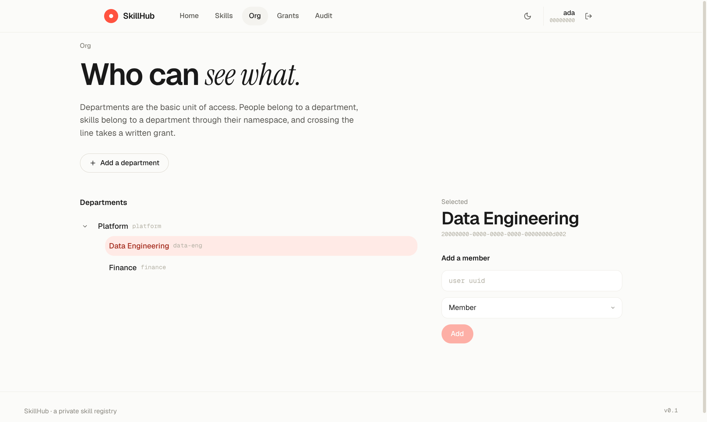

权限不是"角色"而是"部门"。

左边一棵真实的部门树（这里：Platform → Data Engineering / Finance），点哪个部门就在右边管它的成员。

规则简单：

- **你在哪个部门，就能看到那个部门 + 它子部门 + 全局公开的技能**；
- 看不到别的部门的东西，连这个东西"存在"都不知道；
- 想看？走下一步 — 申请 Grant。

---

## 10. 跨部门授权（一切留痕）

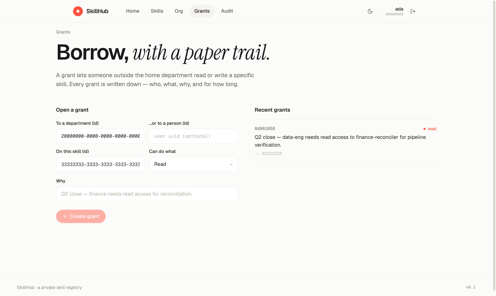

跨部门访问从来不是"打个招呼"，必须**写一张条**：

左侧表单：

- **To a department / or a person** — 给谁
- **On this skill** — 哪个技能
- **Can do what** — Read / Write / Admin
- **Why** — 必填的"原因"

右侧 "Recent grants" 是已经发出去的授权记录，包括理由。

权限链路在后端是这样判的：**super_admin → collaborator → namespace → 部门继承 → grant → 全局可见兜底**。没匹配上就 deny，**deny 也会被写进审计**。

---

## 11. 全平台的事都在这里

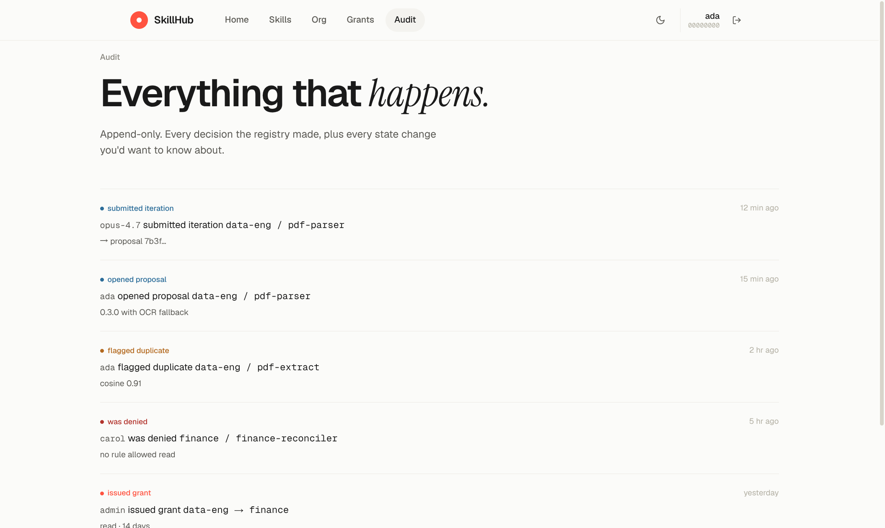

最后一页 — Audit。**追加写入，不能改不能删**。

每一行就是一件事：谁、做了什么、对哪个东西、附加说明、什么时候。

仔细看截图里：

- `opus-4.7 submitted iteration` —— AI 提交了一次迭代
- `ada opened proposal` —— Ada 开了一个提案
- `ada flagged duplicate` —— 查重命中了高相似 (cosine 0.91)
- **`carol was denied`** —— 财务的 Carol 想读 data-eng 的技能被挡了（这就是上面 §9 描述的隔离生效）
- `admin issued grant` —— 后来管理员批了一个跨部门 grant

> 出了任何问题，先翻这页。

---

## 总结 — SkillHub 解决什么问题

| 痛点              | SkillHub 怎么管                                |
| --------------- | ------------------------------------------- |
| 团队里同样的功能被造五遍    | 发布前**语义查重**，名字再换花样也躲不掉                      |
| 改技能没流程，野生分支飞起   | **Draft → Proposal → Merge** 流水线，人和 AI 用同一套 |
| AI 想自己改技能=不可控   | **沙盒化 iteration** + 自动产 proposal + 全程审计     |
| 跨部门技能要么全开放要么全锁死 | 默认按部门隔离，**显式 grant** 才能跨；过期、撤销都记录           |
| 出事查不到原因         | **Audit feed 追加写入**，每个授权决定、每个状态变更都在         |

---

## 给好奇的人

- 后端：Rust + axum + sqlx + Postgres + pgvector
- 前端：React 19 + Vite + TanStack Router/Query + Tailwind v4 + Radix UI
- 单页应用，浅色 / 深色双主题，手机/平板/桌面响应式
- 启动：`docker compose up -d postgres` → `cargo run -p skillhub-app` → 浏览器开 <http://127.0.0.1:8088/>
- 设计与权限的完整说明在 [`docs/design.md`](./design.md)，端到端测试报告在 [`docs/e2e-report.md`](./e2e-report.md)
